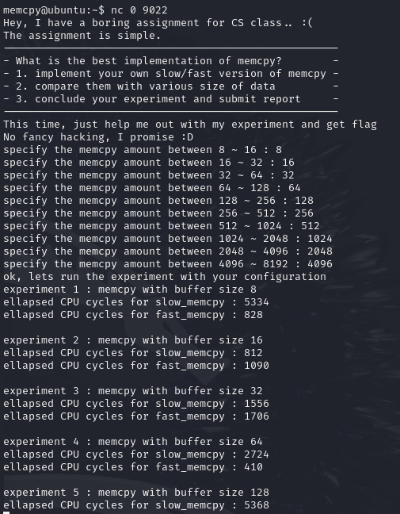
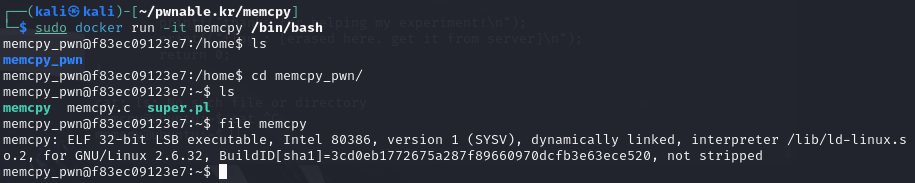
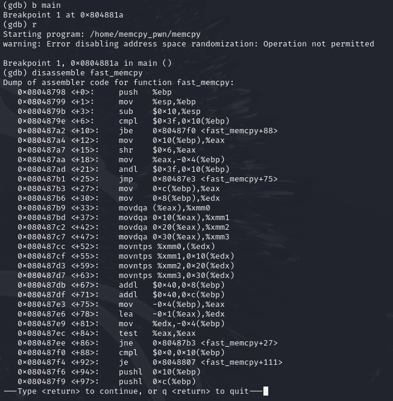
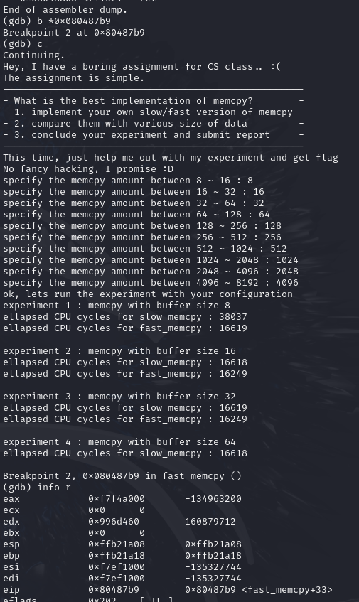
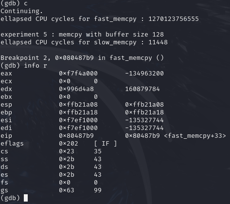
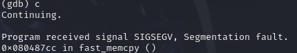
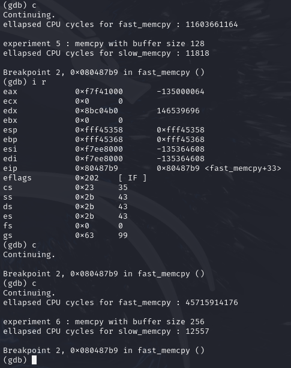
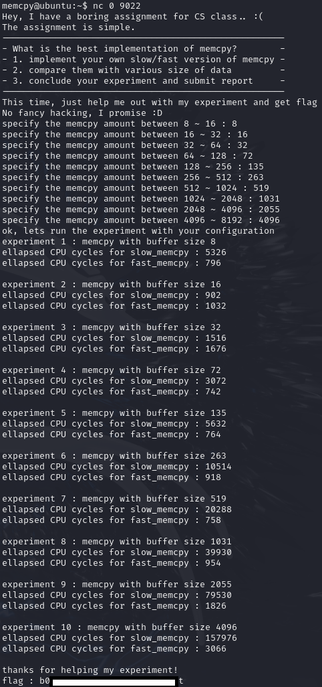

Play this challenge at pwnable.kr: https://pwnable.kr/play.php


# Instructions

>Are you tired of hacking?, take some rest here.
>Just help me out with my small experiment regarding memcpy performance. 
>after that, flag is yours.
>
>ssh memcpy@pwnable.kr -p2222 (pw:guest)

# Provided Files

## readme
```
the compiled binary of "memcpy.c" source code (with real flag) will be executed under memcpy_pwn privilege if you connect to port 9022.
execute the binary by connecting to daemon(nc 0 9022).

nc 0 2000 if service is down
```

## Dockerfile
```Dockerfile
FROM ubuntu:16.04

RUN dpkg --add-architecture i386 && \
    apt update && \
    apt install -y gcc-multilib libc6:i386 lib32stdc++6 lib32z1 gdb file net-tools

RUN apt-get install -y perl
RUN curl -qsL 'https://install.pwndbg.re' | sh -s -- -t pwndbg-gdb

RUN useradd -u 1089 -m memcpy_pwn

COPY memcpy.c /home/memcpy_pwn/memcpy.c
COPY super.pl /home/memcpy_pwn/super.pl

RUN chown root:memcpy_pwn /home/memcpy_pwn/memcpy.c /home/memcpy_pwn/super.pl
WORKDIR /home/memcpy_pwn
RUN gcc -o memcpy memcpy.c -m32 -lm
RUN chown root:memcpy_pwn /home/memcpy_pwn/memcpy
RUN chmod 550 /home/memcpy_pwn/memcpy
RUN chmod 550 /home/memcpy_pwn/super.pl


USER memcpy_pwn
WORKDIR /home
CMD ["perl", "/home/memcpy_pwn/super.pl"]
```

## super.pl
```perl
#!/usr/bin/perl
use Socket;
$port = 9022;
@exec = ("/home/memcpy_pwn/memcpy");
socket(SERVER, PF_INET, SOCK_STREAM, 6);
setsockopt(SERVER, SOL_SOCKET, SO_REUSEADDR, pack("l", 1));
bind(SERVER, sockaddr_in($port, INADDR_ANY));
listen(SERVER,SOMAXCONN);
$SIG{"CHLD"} = "IGNORE";
while($addr = accept CLIENT, SERVER){
    $| = 1;
    ($port, $packed_ip) = sockaddr_in($addr); 
    $datestring = localtime();
    $ip = inet_ntoa($packed_ip);
    print "$ip: $port connected($datestring)\n";
    fork || do {
        $| = 1;
        close SERVER;
        open STDIN,  "<&CLIENT";
        open STDOUT, ">&CLIENT";
        open STDERR, ">&CLIENT";
        close CLIENT;
        exec @exec;
        exit 0;
    };
    close CLIENT;
}
close SERVER;
```

## memcpy.c
```C
// gcc -o memcpy memcpy.c -m32 -lm
#include <stdio.h>
#include <string.h>
#include <stdlib.h>
#include <signal.h>
#include <unistd.h>
#include <sys/mman.h>
#include <math.h>

unsigned long long rdtsc(){
        asm("rdtsc");
}

char* slow_memcpy(char* dest, const char* src, size_t len){
        int i;
        for (i=0; i<len; i++) {
                dest[i] = src[i];
        }
        return dest;
}

char* fast_memcpy(char* dest, const char* src, size_t len){
        size_t i;
        // 64-byte block fast copy
        if(len >= 64){
                i = len / 64;
                len &= (64-1);
                while(i-- > 0){
                        __asm__ __volatile__ (
                        "movdqa (%0), %%xmm0\n"
                        "movdqa 16(%0), %%xmm1\n"
                        "movdqa 32(%0), %%xmm2\n"
                        "movdqa 48(%0), %%xmm3\n"
                        "movntps %%xmm0, (%1)\n"
                        "movntps %%xmm1, 16(%1)\n"
                        "movntps %%xmm2, 32(%1)\n"
                        "movntps %%xmm3, 48(%1)\n"
                        ::"r"(src),"r"(dest):"memory");
                        dest += 64;
                        src += 64;
                }
        }

        // byte-to-byte slow copy
        if(len) slow_memcpy(dest, src, len);
        return dest;
}

int main(void){

        setvbuf(stdout, 0, _IONBF, 0);
        setvbuf(stdin, 0, _IOLBF, 0);

        printf("Hey, I have a boring assignment for CS class.. :(\n");
        printf("The assignment is simple.\n");

        printf("-----------------------------------------------------\n");
        printf("- What is the best implementation of memcpy?        -\n");
        printf("- 1. implement your own slow/fast version of memcpy -\n");
        printf("- 2. compare them with various size of data         -\n");
        printf("- 3. conclude your experiment and submit report     -\n");
        printf("-----------------------------------------------------\n");

        printf("This time, just help me out with my experiment and get flag\n");
        printf("No fancy hacking, I promise :D\n");

        unsigned long long t1, t2;
        int e;
        char* src;
        char* dest;
        unsigned int low, high;
        unsigned int size;
        // allocate memory
        char* cache1 = mmap(0, 0x4000, 7, MAP_PRIVATE|MAP_ANONYMOUS, -1, 0);
        char* cache2 = mmap(0, 0x4000, 7, MAP_PRIVATE|MAP_ANONYMOUS, -1, 0);
        src = mmap(0, 0x2000, 7, MAP_PRIVATE|MAP_ANONYMOUS, -1, 0);

        size_t sizes[10];
        int i=0;

        // setup experiment parameters
        for(e=4; e<14; e++){    // 2^13 = 8K
                low = pow(2,e-1);
                high = pow(2,e);
                printf("specify the memcpy amount between %d ~ %d : ", low, high);
                scanf("%d", &size);
                if( size < low || size > high ){
                        printf("don't mess with the experiment.\n");
                        exit(0);
                }
                sizes[i++] = size;
        }

        sleep(1);
        printf("ok, lets run the experiment with your configuration\n");
        sleep(1);

        // run experiment
        for(i=0; i<10; i++){
                size = sizes[i];
                printf("experiment %d : memcpy with buffer size %d\n", i+1, size);
                dest = malloc( size );

                memcpy(cache1, cache2, 0x4000);         // to eliminate cache effect
                t1 = rdtsc();
                slow_memcpy(dest, src, size);           // byte-to-byte memcpy
                t2 = rdtsc();
                printf("ellapsed CPU cycles for slow_memcpy : %llu\n", t2-t1);

                memcpy(cache1, cache2, 0x4000);         // to eliminate cache effect
                t1 = rdtsc();
                fast_memcpy(dest, src, size);           // block-to-block memcpy
                t2 = rdtsc();
                printf("ellapsed CPU cycles for fast_memcpy : %llu\n", t2-t1);
                printf("\n");
        }

        printf("thanks for helping my experiment!\n");
        printf("flag : [erased here. get it from server]\n");
        return 0;
}
```

# Walkthrough

## Lay of the land
Connecting to `nc 0 9022` and supplying the smallest memcpy amounts results in the "experiment" hanging on experiment 5: 



## Why are we hanging at experiment 5?
To try and figure out why we are hanging at experiment 5, lets looking at the source code for any clues.

Review of memcpy.c shows that the program is running assembly instructions "**movdqa**" (Move Double Quadword Aligned) and "**movntps**" (Move Non-Temporal Packed Single-Precision Floats), which are x86 SIMD (SSE) instructions used for moving data to or from XXM registers (128-bit wide registers). 

If you want to learn more abount Single Instruction, Multiple Data (SIMD) and Streaming SIMD Extensions (SIMD), you can start your rabithole here: 

https://en.wikipedia.org/wiki/Streaming_SIMD_Extensions. 

TL;DR, they make moving data faster but you need to make sure memory is 16 byte aligned when moving to and from these special XXM registers (Otherwise it will segfault). 

i.e. In `movdqa (%0), %%xmm0\n`, `%0` must be a multiple of 16. 

`%0 = 0x92d5c70` is :white_check_mark:, `%0 = 0x92d5c70` is :x: and segfaults.

```C
char* fast_memcpy(char* dest, const char* src, size_t len){
        size_t i;
        // 64-byte block fast copy
        if(len >= 64){
                i = len / 64;
                len &= (64-1);
                while(i-- > 0){
                        __asm__ __volatile__ (
                        "movdqa (%0), %%xmm0\n"
                        "movdqa 16(%0), %%xmm1\n"
                        "movdqa 32(%0), %%xmm2\n"
                        "movdqa 48(%0), %%xmm3\n"
                        "movntps %%xmm0, (%1)\n"
                        "movntps %%xmm1, 16(%1)\n"
                        "movntps %%xmm2, 32(%1)\n"
                        "movntps %%xmm3, 48(%1)\n"
                        ::"r"(src),"r"(dest):"memory");
                        dest += 64;
                        src += 64;
                }
        }

        // byte-to-byte slow copy
        if(len) slow_memcpy(dest, src, len);
        return dest;
}
```

(Also BTW, if you're not familiar with C inline assembly, that `::"r"(src),"r"(dest):"memory"` is defining the inputs and means the `src` pointer is `%0` and `dest` pointer is `%1`.)

The data pointed to by `src` is being moved to the intemediary XMM registers `xmm0-3` in 64 byte chunks (16 bytes * 4) then moved into memory at `dest` in 64 byte chunks (16 bytes * 4). 

`src` and `dest` pointers are initialised with `mmap()` and `malloc()` respecitvely (trace it back yourself), and may not necesarily be 16 byte aligned, which is required for `movdqa` and `movntps`. 

This may be why the "experiment" hangs at experiment 5.. 

## Confirming our suspicions
Let's confirm our suspicions by running gdb on the binary.

We can run the binary in the same environment as the challenge server's environment by using the Dockerfile provided as part of this challenge. Let's spin up the Doceker container. 

Copy `Dockerfile`, `memcpy.c` and `super.pl` into a directory and build/run our container:

```bash
┌──(kali㉿kali)-[~/pwnable.kr/memcpy]
└─$ ls
Dockerfile  memcpy.c  super.pl

┌──(kali㉿kali)-[~/pwnable.kr/memcpy]
└─$ sudo docker build -t memcpy .   

....

┌──(kali㉿kali)-[~/pwnable.kr/memcpy]
└─$ sudo docker run -it memcpy /bin/bash
```

You should now have the binary available to test: 



Disassembling the `fast_memcpy` function shows us the `movdqa` and `movntps` as expected. Importantly, `%0` (the `src` pointer) is register `%eax` and `%1` (the `dest` pointer) is register `%edx`. 



Let's set a breakpoint at the first `movdqa` instruction and see whether the pointers in registers `%eax` and `%edx` are 16 byte memory aligned.



Ok, so at the begining of experiment 4 (which is the first time the `movdqa` and `movntps` instructions are executed), `%eax` and %edx are 16 byte memory aligned (the hex value ends in 0). So experiment 4 should run without segfaulting and we should make it to experiment 5. Lets continue..



We can see `%edx` is NOT 16 byte aligned! We are missing alignment by 8 bytes. Continuing will result in a segfault. 



## Can we memory align %edx?

We know that `%edx` is the `dest` pointer, which is re-initialised by `malloc()` for every new "experiment". 

`malloc()` allocated memory from the heap, and although not guaranteed, typically allocated memory in contiguous regions. i.e. If you do:

```C
a = malloc(16);
b = malloc(16);
```

you *might* get:

```
[a-metadata][a data][b-metadata][b data]
```

In our case, we have control of the size of memory allocated by malloc for each experiment (the amount of memory we "experiment" doing `slow_memcpy` and `fast_memcpy` on).

```C
// run experiment
    for(i=0; i<10; i++){
            size = sizes[i];
            printf("experiment %d : memcpy with buffer size %d\n", i+1, size);
            dest = malloc( size );

            memcpy(cache1, cache2, 0x4000);         // to eliminate cache effect
            t1 = rdtsc();
            slow_memcpy(dest, src, size);           // byte-to-byte memcpy
            t2 = rdtsc();
            printf("ellapsed CPU cycles for slow_memcpy : %llu\n", t2-t1);

            memcpy(cache1, cache2, 0x4000);         // to eliminate cache effect
            t1 = rdtsc();
            fast_memcpy(dest, src, size);           // block-to-block memcpy
            t2 = rdtsc();
            printf("ellapsed CPU cycles for fast_memcpy : %llu\n", t2-t1);
            printf("\n");
    }
```

So for any current experiment, we may be able to adjust the `dest` pointer address by adjusting the *previous* experiments `malloc()` size. 

Let's test out our theory. We found during our gdb testing that the `dest` pointer for experiment 5 was 8 bytes misaligned. So let's add 8 to experiment 4's test size. 

The inputs for the experiment now become: 

```
specify the memcpy amount between 8 ~ 16 : 8
specify the memcpy amount between 16 ~ 32 : 16
specify the memcpy amount between 32 ~ 64 : 32
specify the memcpy amount between 64 ~ 128 : 72     (which is 64+8)
specify the memcpy amount between 128 ~ 256 : 128
specify the memcpy amount between 256 ~ 512 : 256
specify the memcpy amount between 512 ~ 1024 : 512
specify the memcpy amount between 1024 ~ 2048 : 1024
specify the memcpy amount between 2048 ~ 4096 : 2048
specify the memcpy amount between 4096 ~ 8192 : 4096
```



Nice. Experiment 5's `%edx` is now 16 byte aligned and we make it to experiment 6 without segfaulting.

## Solution

Continue this process to find the appropriate experiment sizes for experiment 5,6,7,8 and 9. We find the solution is: 

```
specify the memcpy amount between 8 ~ 16 : 8
specify the memcpy amount between 16 ~ 32 : 16
specify the memcpy amount between 32 ~ 64 : 32
specify the memcpy amount between 64 ~ 128 : 72
specify the memcpy amount between 128 ~ 256 : 135
specify the memcpy amount between 256 ~ 512 : 263
specify the memcpy amount between 512 ~ 1024 : 519
specify the memcpy amount between 1024 ~ 2048 : 1031
specify the memcpy amount between 2048 ~ 4096 : 2055
specify the memcpy amount between 4096 ~ 8192 : 4096
```


